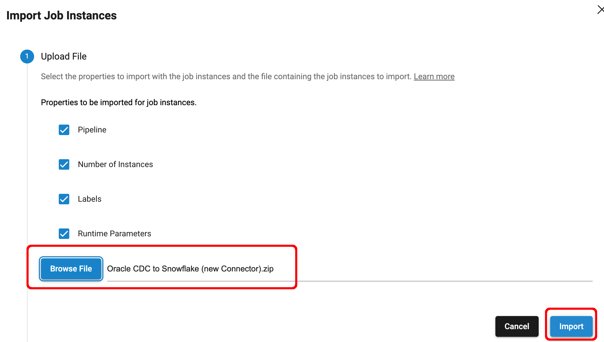
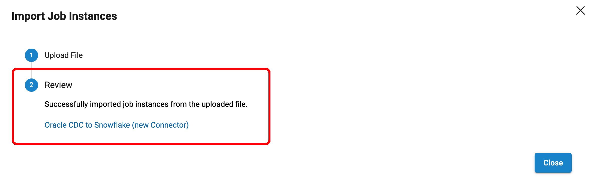

# streamsets-old-jobs-cleanup

This project provides three utility scripts that use the [IBM StreamSets SDK for Python](https://support-streamsets-com.s3.us-west-2.amazonaws.com/streamsets-docs/platform-sdk/latest/index.html) to clean up old Job instances from [IBM StreamSets](https://www.ibm.com/products/streamsets).  The scripts perform the following actions and are intended to be run in the following order to minimize risk when deleting Jobs:

- Script #1 [get-old-jobs.py](python/get-old-jobs.py): This script writes a list of Job instances whose last run was older than a user-defined look-back threshold, for example, a week or a month.

- Script #2 [export-old-jobs.py](python/export-old-jobs.py): This script exports the Job instances in the list created by script #1. The exports serve as backups in case any Job instances deleted by script #3 need to be restored.

- Script #3 [delete-old-jobs.py](python/delete-old-jobs.py): This script deletes the Job instances in the list created by script #1. The script will write a list of Job instances that were successfully deleted and those that were not. Note that Jobs that are referenced by [Sequences](https://www.ibm.com/docs/en/streamsets-controlhub?topic=run-sequences) or [Topologies](https://www.ibm.com/docs/en/streamsets-controlhub?topic=topologies-overview#concept_pvn_d1b_4w) can't be deleted, and will be captured in the list of unsuccessful deletion attempts.  The API credentials used to run this script must have at least read/write permissions on the Job instances in order to delete them. Job instances that were not deleted due to permission issues will also be listed.  

***
Note that all three of these scripts could relatively easily be clubbed together into a single script, and one could add a "dry run" feature, but I chose to use three separate scripts so the critical "delete Job" logic (in script #3) could more easily be inspected for correctness.  Additionally, this approach allows the user to edit the list of old Jobs created by the first script to control which Job instances will be deleted by the third script.

Note also that the scripts rely on an external file to pass around the list of Jobs, rather than using Jog tags to flag Job instances for deletion.  This approach is needed because one can't currently add tags to Job Template Instances.
***

See the details for running each script below.

## PREREQUISITES

- Python 3.9+

- StreamSets Platform SDK for Python v6.6+. Docs are [here](https://docs.streamsets.com/platform-sdk/latest/welcome/installation.html)

 - StreamSets Platform API Credentials for a user with Organization Administrator role

 - Before running any of the scripts, export the environment variables <code>CRED_ID</code> and <code>CRED_TOKEN</code>
  with the StreamSets Platform API Credentials, like this:
```
    	$ export CRED_ID="40af8..."
    	$ export CRED_TOKEN="eyJ0..."
```

## Script #1 - get-old-jobs.py

Description:   This script writes a list of INACTIVE Job instances that have not been run within a user-defined lookback period, for example, a week or a month. The list of old Job instances is written in JSON format to the local file system. Job instances that have not yet been run are ignored as they may have just been created.

Args:

- <code>last_run_threshold</code> - The threshold date to mark Jobs as needing to be cleaned up if the Job's last run was before that date.

- <code>output_file</code> - The full path to a file where the list of old jobs will be written. Directories in the path will be created as needed, and if an existing file of the same name exists, it will be overwritten.

Usage:          <code>$ python3 get-old-jobs.py <last_run_threshold> <output_file></code> 

Usage Example:  <code>$ python3 get-old-jobs.py 2024-06-30 /Users/mark/old-jobs/old_jobs.json</code> 

Example Run:
```
	$ python3 get-old-jobs.py 2024-06-30 /Users/mark/old-jobs/old_jobs.json 
	---------------------------------
	last_run_threshold: '2024-06-30'
	---------------------------------
	Output file: '/Users/mark/old-jobs/old_jobs.json'
	---------------------------------
	Connecting to Control Hub
	---------------------------------
	Writing the list of old Job Instances to output file (this may take a while)...
	---------------------------------
	Done
```
Here is an example of the data written to the output file <code>old_jobs.json</code>. Note that the Jobs are sorted with the oldest last run time first:

```
{"Last Run": "2023-01-12 19:07:00", "Job Name": "Weather to MongoDB", "Job ID": {"Last Run": "2023-01-12 19:07:00", "Job Name": "Weather to MongoDB", "Job ID": "338b33a1-1ad6-47a0-9b66-6b685921d3fc:8030c2e9-1a39-11ec-a5fe-97c8d4369386", "last_run_threshold": "2024-06-30"}
{"Last Run": "2023-07-25 14:37:48", "Job Name": "Weather Raw to Refined (1)", "Job ID": "2369189b-3961-4219-a210-05689b780702:8030c2e9-1a39-11ec-a5fe-97c8d4369386", "last_run_threshold": "2024-06-30"}
{"Last Run": "2024-04-30 21:04:42", "Job Name": "Weather Aggregation", "Job ID": "ca42fe53-5d62-42ef-a546-be8d73de24f6:8030c2e9-1a39-11ec-a5fe-97c8d4369386", "last_run_threshold": "2024-06-30"}
{"Last Run": "2024-05-26 10:42:05", "Job Name": "Oracle to Snowflake Bulk Load", "Job ID": "fe9605ab-4912-4181-a315-e49d031a0d50:8030c2e9-1a39-11ec-a5fe-97c8d4369386", "last_run_threshold": "2024-06-30"}
{"Last Run": "2024-05-29 10:08:11", "Job Name": "Oracle CDC to Snowflake", "Job ID": "00d5d750-527e-4ac3-9417-4b0dcbfcab35:8030c2e9-1a39-11ec-a5fe-97c8d4369386", "last_run_threshold": "2024-06-30"}

```

## Script #2 - export-old-jobs.py

Description:   This script exports the Jobs instances listed in the input file.

Args:

- <code>input_file</code> - A JSON list of Job instances to export (i.e. the output file written by script #1)

- <code>export_dir</code> - The directory to write the exported Jobs instances to. The directory will be created if it does not exist. If the directory does exist, it must be empty

Usage:          <code>$ python3 export-old-jobs.py <input_file> <export_dir></code> 

Usage Example:  <code>$ python3 export-old-jobs.py /Users/mark/old-jobs/old_jobs.json /Users/mark/jobs-export</code> 

Example Run:
```
	$ python3 export-old-jobs.py /Users/mark/old-jobs/old_jobs.json /Users/mark/job-exports 
	---------------------------------
	input_file: '/Users/mark/old-jobs/old_jobs.json'
	---------------------------------
	export_dir: '/Users/mark/job-exports'
	---------------------------------
	Connecting to Control Hub
	---------------------------------
	Exporting Jobs:
	---------------------------------
	Exporting Job 'Weather to MongoDB' into the file '/Users/mark/job-exports/Weather to MongoDB.zip'
	Exporting Job 'Weather Raw to Refined (1)' into the file '/Users/mark/job-exports/Weather Raw to Refined (1).zip'
	Exporting Job 'Weather Aggregation' into the file '/Users/mark/job-exports/Weather Aggregation.zip'
	Exporting Job 'Oracle to Snowflake Bulk Load' into the file '/Users/mark/job-exports/Oracle to Snowflake Bulk Load.zip'
	Exporting Job 'Oracle CDC to Snowflake' into the file '/Users/mark/job-exports/Oracle CDC to Snowflake.zip'
	-------------------------------------
	Done

```
Here is a directory listing of the exported Jobs:

```
	$ ls -l ~/job-exports
	total 888
	-rw-r--r--@ 1 mark  staff   90414 Jul 23 14:43 Oracle CDC to Snowflake.zip
	-rw-r--r--@ 1 mark  staff  135891 Jul 23 14:43 Oracle to Snowflake Bulk Load.zip
	-rw-r--r--@ 1 mark  staff   52758 Jul 23 14:43 Weather Aggregation.zip
	-rw-r--r--@ 1 mark  staff  105615 Jul 23 14:43 Weather Raw to Refined (1).zip
	-rw-r--r--@ 1 mark  staff   59928 Jul 23 14:43 Weather to MongoDB.zip
```

A good test to perform at this point is to manually delete one of those Job instances from Control Hub and to import the corresponding exported file using the Control Hub UI to confirm the exported Job archives are valid, like this:





